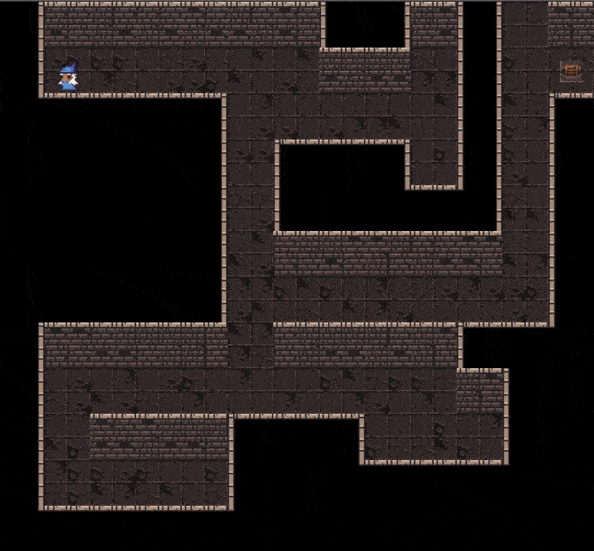

# Amazeing -- Creating a Maze with JavaScript

## Implemented

- Maze generated according to a JS array
- Dungeon **tileset** (free tileset): walls, floor, character, ladders and treasure chest
- **Animated character** (idle and running)
- **Keyboard support** (arrow keys)
- Double move impossible to prevent visual bugs
- Local storage to keep the progression

## Would be nice to implement

- Options panel on `ESC` to choose the pace of the hero (slow, normal or fast), to restart, or to go back to a previously finished level
- Sound effects (footsteps, echo, ping on win, sparkling on opening the treasure chest...)

## Preview

